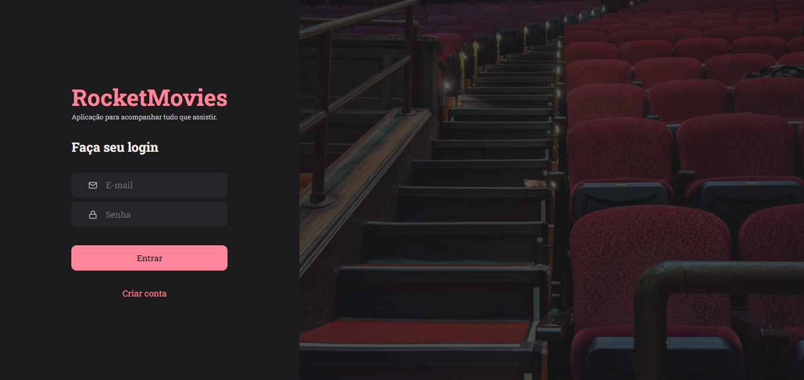
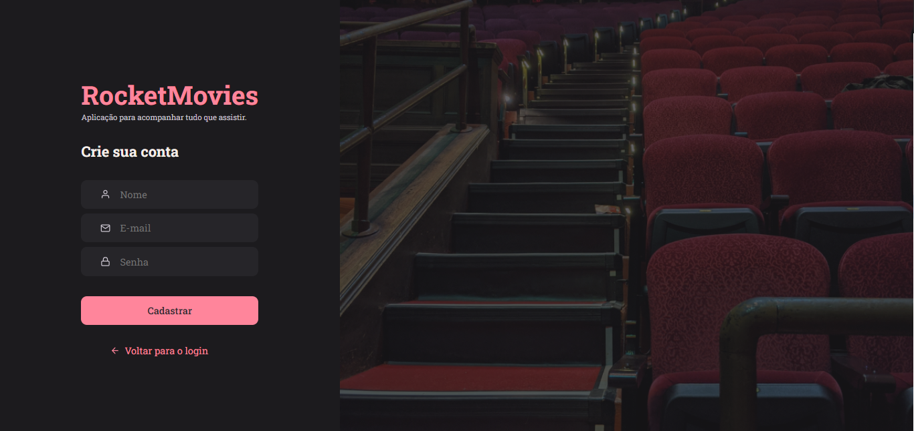
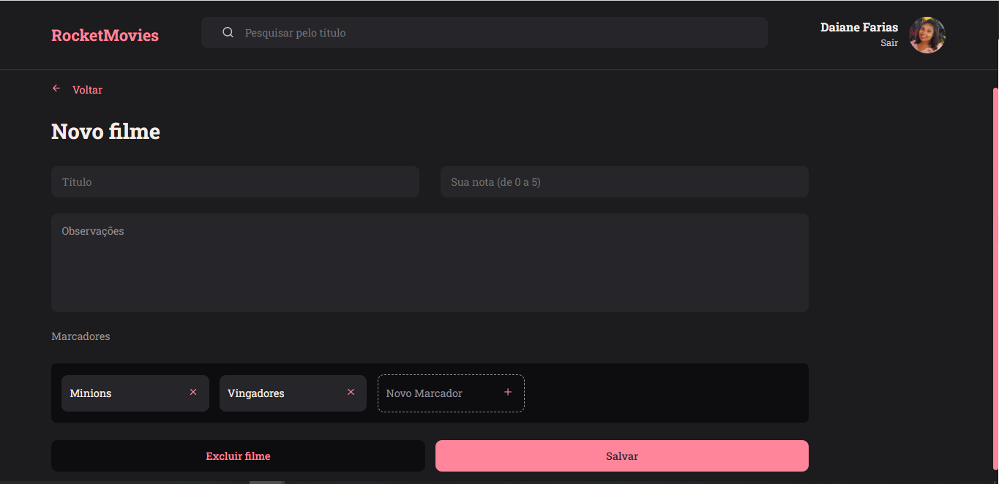
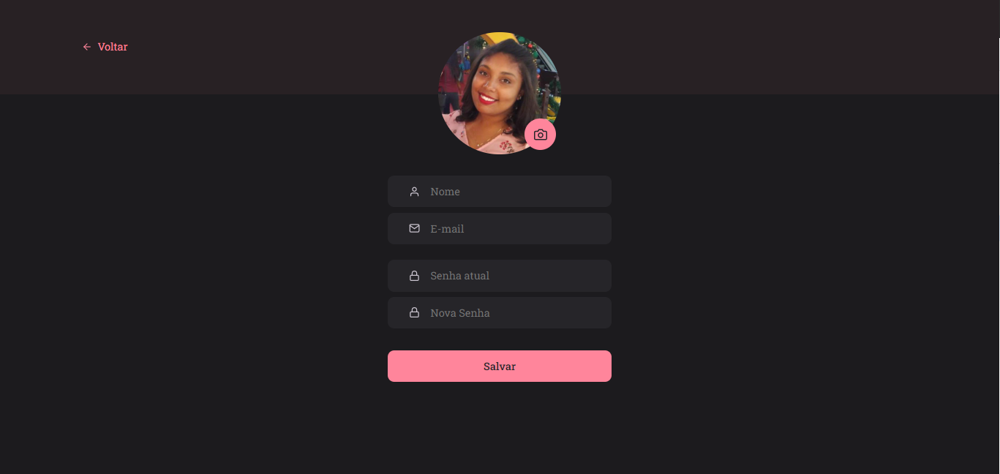
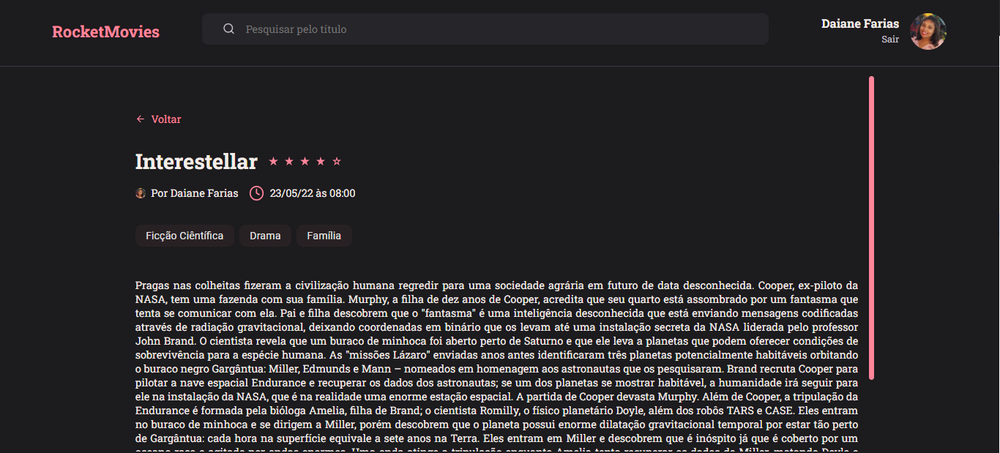

<h1 align="center"> MyMovies </h1>

  <a href="#-tecnologias">Tecnologias</a>&nbsp;&nbsp;&nbsp;|&nbsp;&nbsp;&nbsp;
  <a href="#-projeto">Projeto</a>&nbsp;&nbsp;&nbsp;|&nbsp;&nbsp;&nbsp;
  <a href="#-layout">Layout</a>&nbsp;&nbsp;&nbsp;|&nbsp;&nbsp;&nbsp;
  <a href="#memo-licença">Licença</a>

  

  Projeto onde trabalhei o front end com React. Foi um projeto proposto pela #Rocketseat com exercício do stage 09 onde pude colocar em prática tudo que foi aprendendido sobre componentização, styled-component e mais.

 
 

## 🚀 Tecnologias

Esse projeto foi desenvolvido com as seguintes tecnologias:

- ViteJS;
- JavaScript;
- ReactJS.

 
 

## 🔖 Layout
Página de SingIn:

Página de Singup:

Página de Home:

Página de Novos Filmes:

Página de Perfil:

Página de Detalhes dos filmes:

---
Feito por Daiane Farias 👋  [Me acompanhe nas redes sociais!](https://daiaanebarbosaf.github.io/rocketlinks/)